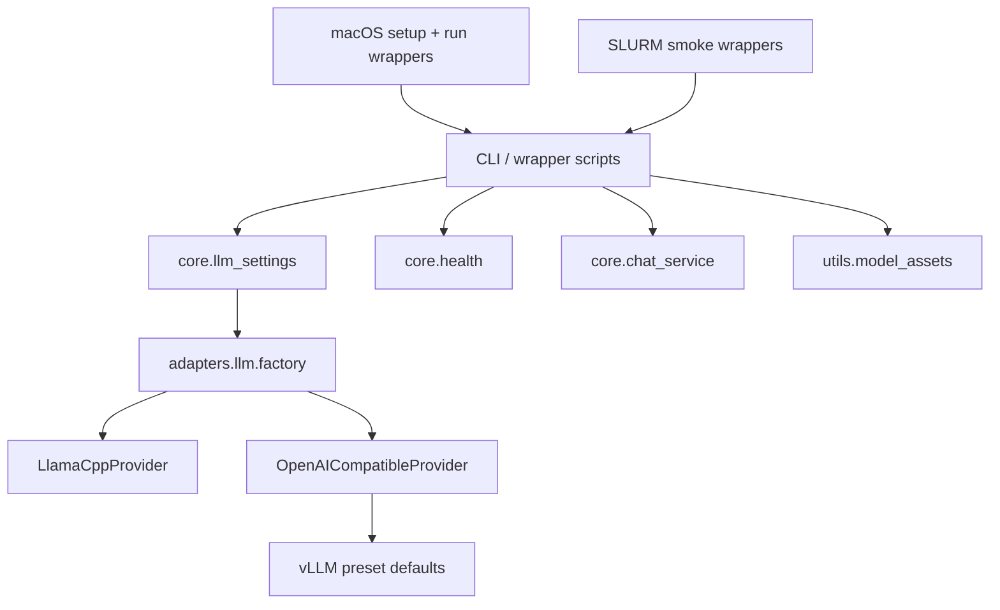

# HPC LLM Deployment Substrate Port

Port the reusable LLM deployment substrate from `oarc-ai-assistant` into
`deid-local` without bringing over RAG, evaluation, or MLflow concerns.

## Context & Problem

`deid-local` currently provides only scaffold-level runtime checks. The existing
`oarc-ai-assistant` repository already contains working local and HPC deployment
patterns for LLM-backed workflows, but those patterns are mixed together with
RAG, evaluation, and observability code that does not belong in this repository.

The immediate need is to establish a clean, typed deployment substrate that
supports:

- local `llama.cpp` smoke testing,
- remote OpenAI-compatible inference with a `vllm` preset,
- model asset helpers,
- local and HPC launcher wrappers,
- a local browser chat window for smoke testing.

## Goals / Non-goals

- Goals:
  - Add typed LLM provider adapters for `llama_cpp`, `openai_http`, and `vllm`.
  - Add CLI commands for config inspection, health checks, inference, chat, and
    model asset handling.
  - Add macOS and SLURM wrapper scripts that stay free of hard-coded
    user- or cluster-specific paths.
  - Use `./models/llm/Phi-3-mini-4k-instruct-q4.gguf` as the default smoke-test
    model location.
  - Keep environment configuration env-only with documented legacy alias support.
- Non-goals:
  - No RAG pipeline, vector store, or retrieval code.
  - No MLflow, evaluation, or telemetry support.
  - No `.env` loading or `python-dotenv`.
  - No server lifecycle management for vLLM beyond client-side health/inference.

## Design Overview

The implementation introduces a provider settings layer, adapter interfaces,
health helpers, CLI commands, and thin launcher wrappers.

## Alternatives Considered

- Port the full deployment + MLflow stack now:
  rejected because it would entangle this repository with evaluation and logging
  concerns before the core runtime surface is stable.
- Port only remote HTTP inference:
  rejected because local `llama.cpp` smoke testing is part of the intended
  local-first workflow for this repository.

## Implementation Plan

- [x] Milestone 0: add this plan and create a dedicated worktree/branch.
- [x] Milestone 1: add LLM settings parsing, provider interfaces, adapters, and
      health helpers.
- [x] Milestone 2: add CLI commands and model asset helpers.
- [x] Milestone 3: add local/HPC deployment wrappers and deployment docs.
- [x] Milestone 4: add a local browser chat window for smoke testing.

## Data Model & Migrations

There are no database or serialized-data migrations. The change adds typed
runtime settings and request/response objects inside the Python package.

## Testing Strategy

- Unit tests for settings precedence, provider dispatch, health probing, CLI
  behavior, and chat history formatting.
- Integration tests for mocked OpenAI-compatible endpoints.
- Slow smoke test for `llama.cpp` that auto-skips unless
  `./models/llm/Phi-3-mini-4k-instruct-q4.gguf` exists and the optional extra is
  installed.
- Manual macOS and SLURM smoke validation through the wrapper scripts.

## Rollout & Telemetry

Roll out in milestone-sized commits. Core adapter and CLI functionality land
first, wrappers/docs second, and the chat window last. This slice intentionally
does not add telemetry.

## Risks & Mitigations

- Risk: optional dependencies such as `llama-cpp-python` and Flask are missing.
  Mitigation: keep them behind extras and return actionable runtime errors.
- Risk: legacy HPC environment variables diverge from the new `DEID_*` names.
  Mitigation: support documented alias fallback order.
- Risk: wrapper scripts become cluster-specific again.
  Mitigation: require env-driven paths and avoid embedding usernames, Conda
  environments, scratch roots, or module commands.

## Security & Privacy

- Do not read `.env*` files.
- Redact API keys from config output.
- Keep chat history process-local and in-memory only.
- Treat model assets as untracked runtime artifacts.

## Docs to Update

- README
- docs/deployment.md
- scripts/README.md
- CHANGELOG.md

## Rollback Plan

Remove the added CLI groups, new adapter modules, and deployment wrappers while
leaving `deid-local doctor` intact. Optional extras can then be removed from
`pyproject.toml`.

## Decision Log

- 2026-03-05: Initial plan created.
- 2026-03-05: Locked first-slice backends to `llama_cpp`, `openai_http`, and
  `vllm`.
- 2026-03-05: Set `./models/llm/Phi-3-mini-4k-instruct-q4.gguf` as the default
  smoke-test model path.
- 2026-03-05: Completed implementation in `codex/feat-hpc-llm-port` using the
  dedicated `../deid-local-hpc-llm-port` worktree.
