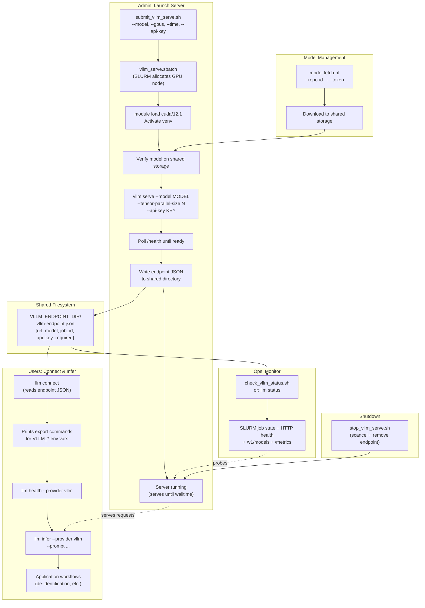

# Plan: Multi-User vLLM Hosting on HPC

## Status

Done (completed on 2026-03-06).
Closing PR: https://github.com/epunzal2/deid-local/pull/1

## Context

The project has a working **client-side** LLM substrate (provider adapters, CLI, health
checks, smoke-test SLURM scripts) but cannot launch or manage a vLLM server. The goal is
a persistent, multi-user vLLM inference service on HPC (target GPUs: 4x A100 40G,
2x V100 32G, 4x L40S 40G) that any researcher can discover and use. Initial model:
`meta-llama/Llama-3-8B-Instruct`.

The user runs all HPC scripts manually and relays outputs. CUDA requires `module load`
(default: `cuda/12.1`). Endpoint discovery uses a shared group directory via env var.

**Naming convention**: No `DEID_` prefix. Env vars use `VLLM_*` for vLLM-specific and
`LLM_*` for generic settings. The `src/deid_local/` package path is renamed to `src/`
flat layout — modules live directly under `src/` (e.g. `src/core/`, `src/adapters/`,
`src/cli.py`).

## Workflow Diagram



## Git Workflow

- Create feature branch `feat/hpc-vllm-serve` from `main`
- Implement each milestone as one or more commits on the branch
- Run `uv run pytest` after each milestone — must pass
- Merge to `main` when all milestones complete and tests green

## Milestones

Execution order: **M0 → M1 → M4 → M2 → M3 → M5 → M6 → M7**

Tests are written incrementally with each milestone.

---

### M0: Rename Package from `deid_local` to Flat `src/` Layout

**Goal**: Remove `deid_local` naming from the package path and env vars so the LLM
deployment infrastructure is generic.

**Changes:**
- Move `src/deid_local/*` → `src/` (flatten: `src/core/`, `src/adapters/`,
  `src/cli.py`, `src/utils/`, `src/__init__.py`, `src/__main__.py`)
- Update `pyproject.toml`:
  - Change `[project.scripts]` entry point from `deid_local.cli:main` to `cli:main`
    (or a new generic name)
  - Configure hatchling to find packages in `src/`
- Update all imports: `from deid_local.core.X` → `from core.X`, etc.
- Rename all `DEID_*` env vars in `src/core/llm_settings.py`:
  - `DEID_LLM_PROVIDER` → `LLM_PROVIDER`
  - `DEID_VLLM_BASE_URL` → `VLLM_BASE_URL`
  - `DEID_VLLM_MODEL` → `VLLM_MODEL`
  - `DEID_VLLM_API_KEY` → `VLLM_API_KEY`
  - `DEID_VLLM_HEALTH_URL` → `VLLM_HEALTH_URL`
  - `DEID_LLAMA_MODEL_PATH` → `LLAMA_MODEL_PATH`
  - `DEID_LLAMA_CTX` → `LLAMA_CTX`
  - `DEID_LLAMA_GPU_LAYERS` → `LLAMA_GPU_LAYERS`
  - `DEID_LLM_TIMEOUT_S` → `LLM_TIMEOUT_S`
  - `DEID_LLM_MAX_RETRIES` → `LLM_MAX_RETRIES`
  - etc.
- Update all tests, scripts, docs, and README to match
- Update CLI entry point name (e.g. `deid-local` → keep or rename — user to decide)

**Note**: This is a large refactor. All subsequent milestones use the new naming.

---

### M1: vLLM Server Launch on HPC

**Goal**: `sbatch` launches vLLM on a GPU node, polls health, prints the URL.

**New files:**
- `scripts/deployment/hpc/vllm_serve.sbatch`
  - SLURM header (all jobs use this standard template):
    ```
    #SBATCH --job-name=vllm_serve
    #SBATCH --output=logs/%x_%N_%j.out
    #SBATCH --error=logs/%x_%N_%j.err
    #SBATCH --partition=gpu
    #SBATCH --gres=gpu:1
    #SBATCH --constraint='volta|adalovelace|ampere'
    ```
  - Additional defaults: 8 CPUs, 32G RAM, 4h walltime
  - Loads CUDA module via `CUDA_MODULE` env var (default: `cuda/12.1`)
  - Activates venv, launches `vllm serve` in background
  - Polls `/health` with curl (default 300s timeout)
  - Writes endpoint JSON if `VLLM_ENDPOINT_DIR` is set
  - `wait` on server PID to keep job alive
  - Env vars: `VLLM_MODEL`, `VLLM_PORT` (default 8000), `VLLM_HOST` (default 0.0.0.0),
    `VLLM_TENSOR_PARALLEL` (default 1), `VLLM_MAX_MODEL_LEN` (default 4096),
    `VLLM_GPU_MEMORY_UTILIZATION` (default 0.90), `VLLM_API_KEY`, `VLLM_DTYPE` (default
    auto), `VLLM_EXTRA_ARGS`, `VLLM_HEALTH_TIMEOUT` (default 300)
- `scripts/deployment/hpc/submit_vllm_serve.sh`
  - Flags: `--model`, `--gpus`, `--time`, `--port`, `--api-key`, `--max-model-len`
  - `--gpus` also sets `VLLM_TENSOR_PARALLEL`

**Modify:** `scripts/README.md`

---

### M4: Model Management on HPC

**Goal**: Download large HF model snapshots with auth to shared storage.

**New files:**
- `scripts/deployment/hpc/fetch_model.sh` — Wrapper for CLI `model fetch-hf`

**Modify:**
- `src/utils/model_assets.py` — Add `download_hf_snapshot()` using
  `huggingface_hub.snapshot_download` (follows existing `_import_hf_download` pattern)
- `src/cli.py` — Add `model fetch-hf` subcommand with `--repo-id`, `--output-dir`,
  `--token` (reads `HF_TOKEN` from env), `--revision`
- `src/core/llm_settings.py` — Add `VLLM_MODEL_PATH` env var (local path takes
  precedence over HF model ID)
- `tests/unit/test_model_assets.py` — Test `download_hf_snapshot` with mock
- `tests/unit/test_llm_settings.py` — Test `VLLM_MODEL_PATH` precedence
- `tests/unit/test_cli.py` — Test `model fetch-hf` parser

---

### M2: Persistent Service & Endpoint Discovery

**Goal**: Long-running server, discoverable endpoint file on shared filesystem, status
check, clean shutdown.

**New files:**
- `src/core/endpoint_discovery.py`
  - `EndpointInfo` dataclass: `base_url`, `health_url`, `model`, `node`, `port`,
    `slurm_job_id`, `started_at`, `api_key_required`
  - `read_endpoint(endpoint_dir)` → `EndpointInfo | None`
  - `write_endpoint(info, endpoint_dir)` → `Path`
  - `resolve_endpoint_dir()` — reads `VLLM_ENDPOINT_DIR` env var
- `scripts/deployment/hpc/check_vllm_status.sh` — Reads endpoint JSON, queries
  `squeue`, probes `/health`
- `scripts/deployment/hpc/stop_vllm_serve.sh` — `scancel` + remove endpoint file
- `tests/unit/test_endpoint_discovery.py` — Round-trip, missing file, custom dir

**Modify:**
- `scripts/deployment/hpc/submit_vllm_serve.sh` — Add `--endpoint-dir` flag

---

### M3: Multi-User Access

**Goal**: Users discover the endpoint and connect with API key auth.

**Modify:**
- `src/cli.py` — Add `llm connect` subcommand:
  - Reads endpoint JSON, prints export commands for `VLLM_*` env vars
  - `--endpoint-dir`, `--api-key`, `--test` (health check) flags
  - Add `--api-key` to common LLM argument parser (already flows through to
    `health.py:_build_headers()`)
- `tests/unit/test_cli.py` — Test `llm connect` with mock endpoint file
- `tests/integration/test_http_cli.py` — Test API key auth passthrough

---

### M5: Monitoring & Observability

**Goal**: `llm status` aggregates health, SLURM state, and model info.

**New files:**
- `src/core/server_status.py`
  - `ServerStatus` dataclass: `endpoint`, `healthy`, `http_status_code`,
    `slurm_state`, `model_info`, `error`
  - `build_server_status(endpoint, api_key)` — probes HTTP health, `/v1/models`,
    and `squeue` (best-effort, `FileNotFoundError`-safe)
  - `format_server_status(status)` → formatted string
- `tests/unit/test_server_status.py` — Mock HTTP and subprocess

**Modify:**
- `src/cli.py` — Add `llm status` subcommand with `--endpoint-dir`, `--api-key`

---

### M6: Integration Tests & Verification Scripts

**Goal**: Comprehensive test coverage, GPU tests gated behind env flags.

**New files:**
- `tests/unit/test_slurm_scripts.py` — Static validation of `.sbatch` files
  (shebang, `#SBATCH`, required directives: `--partition=gpu`,
  `--constraint='volta|adalovelace|ampere'`, `--output=logs/%x_%N_%j.out`,
  `--error=logs/%x_%N_%j.err`, no hard-coded usernames/paths)
- `tests/integration/test_concurrent_requests.py` — ThreadPoolExecutor sending
  N requests to mock server (extends `_MockOpenAIHandler` pattern from
  `test_http_cli.py`)
- `scripts/deployment/hpc/verify_vllm_serve.sh` — Manual HPC verification wrapper
  (timestamped logs in `verification/`, sets env flags, runs pytest)

---

### M7: Documentation & Manual Test Runbook

**New files:**
- `docs/hpc-vllm-guide.md` — Full guide: prerequisites, quickstart, step-by-step
  (bootstrap → model download → launch → connect → monitor → shutdown),
  env var reference, GPU-specific notes (A100 vs V100 vs L40S), troubleshooting
- `docs/hpc-vllm-manual-test.md` — Step-by-step manual verification runbook:
  exact copy-paste commands and expected outputs for each step, what to relay back

**Modify:**
- `docs/deployment.md` — Add section linking to HPC vLLM guide
- `README.md` — Brief mention of HPC vLLM serving
- `CHANGELOG.md` — Entries under `[Unreleased]`
- `scripts/README.md` — Final update with all new scripts

---

## Environment Variables (New)

| Variable | Purpose | Default |
|----------|---------|---------|
| `VLLM_PORT` | Server port | `8000` |
| `VLLM_HOST` | Server bind address | `0.0.0.0` |
| `VLLM_MAX_MODEL_LEN` | Max sequence length | `4096` |
| `VLLM_TENSOR_PARALLEL` | GPU count for TP | `1` |
| `VLLM_DTYPE` | Model dtype | `auto` |
| `VLLM_GPU_MEMORY_UTILIZATION` | GPU mem fraction | `0.90` |
| `VLLM_EXTRA_ARGS` | Additional vllm flags | (empty) |
| `VLLM_HEALTH_TIMEOUT` | Startup health wait (s) | `300` |
| `VLLM_ENDPOINT_DIR` | Shared endpoint dir | (must be set by user) |
| `VLLM_MODEL_PATH` | Local model weight path | (falls to `VLLM_MODEL`) |
| `CUDA_MODULE` | Module to load for CUDA | `cuda/12.1` |
| `HF_TOKEN` | HuggingFace auth token | (standard HF convention) |

## Key Design Decisions

1. **Server lifecycle stays in SLURM scripts, not Python** — `core/` remains a client
   library. No subprocess orchestration in Python modules.
2. **Endpoint discovery via shared filesystem JSON** — `VLLM_ENDPOINT_DIR` points to a
   group-readable directory on cluster shared storage.
3. **Module load is env-var driven** — `CUDA_MODULE` avoids hard-coding while supporting
   clusters that require it. Default: `cuda/12.1`.
4. **Single shared API key** — vLLM's `--api-key` flag. Per-user keys possible later
   via `VLLM_EXTRA_ARGS="--allowed-api-keys k1,k2"`.
5. **GPU flexibility** — Tensor parallelism and memory utilization are configurable.
   A100 40G fits Llama-3-8B on 1 GPU; V100 32G may need `--max-model-len 2048`;
   L40S 40G works like A100.
6. **Generic naming** — No `DEID_` prefix anywhere. Package path flattened from
   `src/deid_local/` to `src/`. Infra is reusable across research applications.

## Existing Code to Reuse

- `src/core/health.py:probe_provider_health()` — reuse for status checks
- `src/core/health.py:_build_headers()` — reuse for API key auth headers
- `tests/integration/test_http_cli.py:_MockOpenAIHandler` — extend for concurrent tests
- `tests/integration/test_vllm_e2e.py` — pattern for gated E2E with subprocess server
- `scripts/deployment/hpc/vllm_smoke.sbatch` — pattern for env-var driven SLURM scripts

## Verification

After each milestone:
1. `uv run ruff check .` and `uv run ruff format --check .`
2. `uv run pytest` (unit + integration, excluding slow)
3. Manual HPC verification following `docs/hpc-vllm-manual-test.md`
4. User relays HPC outputs for review

End-to-end validation:
1. Bootstrap HPC env → fetch model → submit server → wait for healthy
2. From another node: `llm connect --test` → health passes
3. `llm infer --provider vllm --prompt "Reply with pong."` → get response
4. `llm status` → shows RUNNING + HEALTHY
5. `stop_vllm_serve.sh` → job cancelled, endpoint file removed
