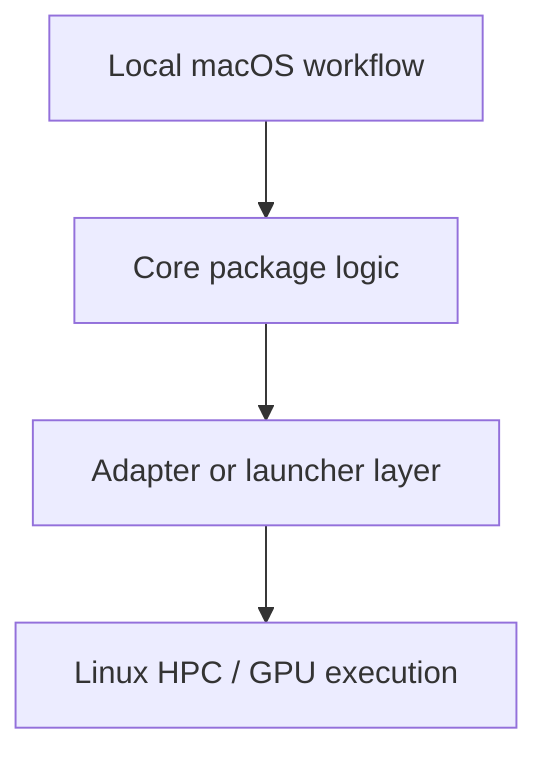

# Plan Title

Short summary of the problem and the proposed direction.

## Context & Problem

Describe the current state, the user need, and why the work matters now.

## Goals / Non-goals

- Goals:
- Non-goals:

## Design Overview

Describe the architecture and boundaries.

## Alternatives Considered

- Alternative 1:
- Alternative 2:

## Implementation Plan

- [ ] Milestone 1
- [ ] Milestone 2
- [ ] Milestone 3

## Data Model & Migrations

State whether there are schema, serialization, or storage changes.

## Testing Strategy

List the unit, integration, and manual checks.

## Rollout & Telemetry

Explain how the change will be enabled, observed, and validated.

## Risks & Mitigations

- Risk:
- Mitigation:

## Security & Privacy

Call out secrets handling, access control, data retention, or other concerns.

## Docs to Update

- README
- docs/
- CHANGELOG

## Rollback Plan

Describe how to disable or revert the change safely.

## Decision Log

- YYYY-MM-DD: Initial draft created.
